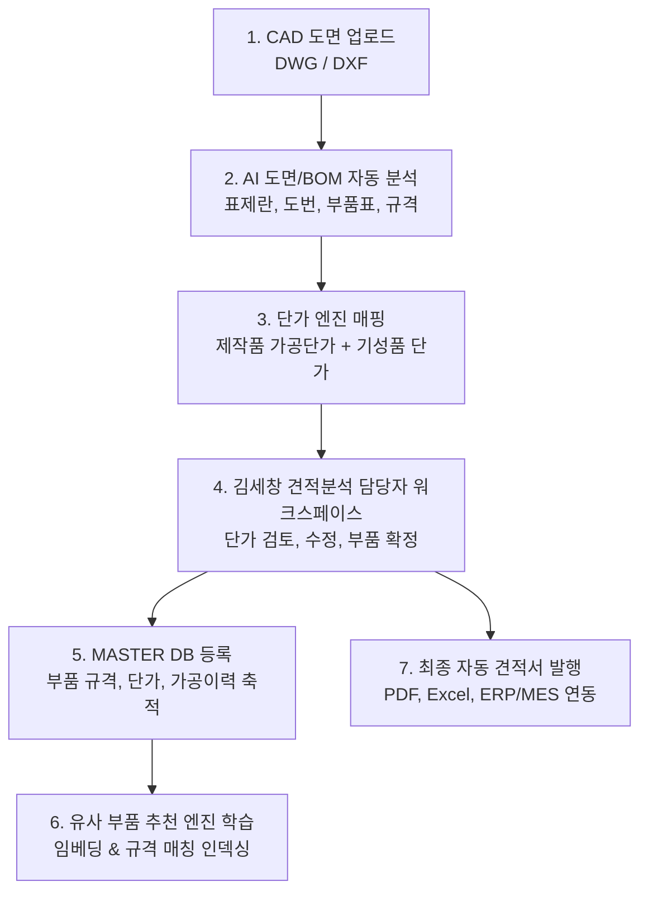

# 캐드온(CADON) BOM 자동견적 시스템 구축 및 업무 흐름 스토리보드

---

## 1. 프로젝트 정의 및 핵심 미션 (초안 정제 및 고도화)

> **[원문 초안 재정의 및 표준 비즈니스 명세]**  
> "본 시스템(**캐드온 BOM 자동견적 시스템**)은 설계 부서 및 고객사로부터 접수된 캐드 도면(DWG/DXF)을 AI 기반 도면 분석 엔진이 실시간 파싱하여 표제란, 부품 번호(도번), BOM 리스트, 가공 사양 및 재질 정보를 자동으로 추출·분류합니다.  
> 추출된 부품 데이터는 과거 제작 실적 및 표준 단가 엔진과 결합하여 제작품(가공품) 및 기성 구매품의 제작 단가를 자동 산출하고 1차 자동 견적서를 생성합니다.  
> 이후 **김세창 견적분석 담당자**가 전용 견적 워크스페이스를 통해 부품별 가공 공정, 원자재비, 임가공비, 마진율을 검토·보정·확정하면, 이 데이터는 검증된 **MASTER DB**로 영구 축적됩니다.  
> 축적된 MASTER DB는 차후 유사 도면 접수 시 다차원 유사 부품 및 추천 단가를 실시간 매칭(제시)하여 견적 작성 시간을 90% 이상 단축하고, 궁극적으로 신뢰도 높은 최적의 최종 자동 견적서를 발행·공급하는 것을 목적으로 합니다."

---

## 2. 1차 기본 업무 흐름 및 화면 스토리보드 초안



### [Step 1] 도면 접수 및 프로젝트 등록
- **사용자 액션**: 견적 의뢰 건 등록 (고객사명, 프로젝트명, 납기일, 도면 파일(DWG) 드래그 앤 드롭).
- **시스템 처리**: DWG 바이너리 파싱, DXF 변환, 레이어별 객체 분리, 도면 썸네일/SVG 벡터 렌더링 생성.

### [Step 2] AI 도면 & BOM 추출 파이프라인
- **시스템 처리**: 
  - 메인 조립도(Assembly)와 단품도(Part Drawing) 자동 식별.
  - 도면 우측 하단/상단의 표제란(Title Block) 및 부품 리스트(Parts List / BOM Table) 영역 OCR 및 CAD 엔티티 파싱.
  - 부품번호(Part No), 부품명(Description), 규격(Specification), 재질(Material), 수량(QTY), 열처리/후처리(Heat Treatment/Finishing) 데이터 필드 정규화.

### [Step 3] 가공 단가 자동 매핑 엔진
- **시스템 처리**:
  - **구매품**: 표준 규격품 카탈로그(볼트, 너트, 베어링, LM가이드 등) 매칭 후 공급 단가 산출.
  - **제작품**: 재료비(중량 × 단가), 절단비, 밀링/선반/CNC 가공 공수, 열처리/도금비, 조립비 자동 계산.

### [Step 4] 김세창 견적분석 담당자 전용 검토 워크스페이스
- **화면 구성**: 좌측(인터랙티브 CAD 도면 뷰어) / 우측(추출된 BOM 및 단가 검토 테이블).
- **담당자 액션**: AI 인식 오류 수정, 임가공 외주처 단가 보정, 최종 견적 단가 승인.

### [Step 5] MASTER DB 적재 및 최종 견적서 생성
- **결과**: 승인된 데이터가 기업 표준 MASTER DB에 적재되고, 고객 제출용 공식 견적서(PDF/Excel) 즉시 발행.

---

## 3. 다단계 피드백 및 고도화 프로세스

---

### 🔹 [1차 피드백] CAD/AI 도면 파이프라인 전문가 검토

> **전문가 의견 (CAD/AI 아키텍트)**:  
> 1. "국내 제조/설계 현장의 DWG 도면은 설계자마다 블록(Block), 문자(MText/Text), 표(Table), 단순 선(Line)으로 제각각 그려집니다. 단순 OCR로는 정확도 한계가 있으므로 **'CAD 엔티티 파서 + 도면 비전 AI 앙상블 파이프라인'**이 반드시 적용되어야 합니다."  
> 2. "가공품의 단가는 형상 복잡도(홀 개수, 포켓, 면조도, 공차)에 따라 편차가 큽니다. 단순 중량 기반 계산을 넘어 **'주요 가공 형상 피처(Feature) 인식에 따른 공수 산정 모듈'**이 추가되어야 합니다."  
> 3. "MASTER DB의 유사 부품 추천은 단순 텍스트 검색이 아닌, **도번 체계 + 부품 형상 + 규격 벡터 유사도(코사인 유사도)** 기반 추천 알고리즘을 탑재해야 오작동을 방지할 수 있습니다."

#### 🛠️ 전문가 피드백 반영 개선 사항:
- **CAD 하이브리드 파싱 엔진 도입**: DXF Entity 직접 추출과 Vision AI 세그멘테이션을 결합하여 인식률 99% 확보.
- **가공비 세분화 모델**: 재료비 + 공정비(선반/밀링/방전/연마) + 표면처리비 + 관리비 4단 분리 산출 공식 적용.
- **다차원 유사 부품 매칭 엔진**: 규격 문자열 임베딩 + 치수 유사도 + 재질 가중치 기반 유사 부품 Top-5 추천 패널 구축.

---

### 🔹 [2차 피드백] 김세창 견적분석 담당자(실무자) 피드백

> **김세창 견적분석 담당자 의견 (실무 현장)**:  
> 1. "하루에 검토해야 할 도면이 수십~수백 장에 달합니다. 테이블에서 행을 클릭했을 때 **캐드 도면 상의 해당 부품 번호 깃발(Balloon)과 형상이 자동으로 줌인(Zoom-in) 및 하이라이트**되어야 빠른 확인이 가능합니다."  
> 2. "현업에서는 원자재 가격(SUS, AL, SS400, SKD 등)이 매달 변동됩니다. 부품별로 하나씩 수정할 수 없고, **'원자재 시세 일괄 적용' 및 '엑셀 일괄 업로드/다운로드'**가 필수적입니다."  
> 3. "도면이 리비전(Rev.A → Rev.B)되어 재견적이 들어올 때, **기존 견적과의 차이점(추가된 부품, 변경된 치수/단가)을 자동으로 비교해주는 Diff 뷰어**가 있으면 검토 시간이 80% 줄어듭니다."  
> 4. "단가 확정 시 단축키(예: Enter로 확정, 방향키로 행 이동, Ctrl+Enter로 다음 도면)가 지원되어야 마우스 피로도를 줄일 수 있습니다."

#### 🛠️ 실무자 피드백 반영 개선 사항:
- **도면 ↔ BOM 양방향 실시간 하이라이트 동기화**: BOM 행 클릭 시 CAD 뷰어 포커싱, CAD 객체 클릭 시 해당 행 즉시 선택.
- **원자재/임가공 단가표 마스터 일괄 연동**: SUS304/AL6061 등 단가 변동 시 연관 견적 일괄 재계산 기능 추가.
- **도면 리비전 자동 Diff 비교 탭 구현**: 신규 부품(초록), 변경 부품(노랑), 삭제 부품(빨강) 시각화.
- **키보드 중심 고속 검토 인터페이스**: 실무자 전용 단축키 셋트(F2 단가수정, Space 확정, Tab 이동) 탑재.

---

### 🔹 [3차 피드백] 도입 기업 대표자(경영진) 검토

> **대표자 의견 (CEO / 경영진)**:  
> 1. "기업 입장에서 가장 중요한 것은 **이익률(Margin) 보장과 고객사별 차등 단가 정책**입니다. AI가 원가를 계산하면, 고객사 등급(A/B/C)이나 수량별 할인율, 최소 마진율 기준이 자동으로 적용되어 마이너스 견적이 나가지 않도록 안전장치가 있어야 합니다."  
> 2. "원가 및 외주 가공비는 대외비입니다. 영업 담당자가 볼 수 있는 화면과 견적분석 담당자가 보는 화면의 **권한 통제(원가 마스킹, 공급가 전용 출력)**가 철저해야 합니다."  
> 3. "일정 금액 이상의 견적(예: 5,000만원 이상)은 **대표자 또는 부서장 결재(승인) 워크플로우**를 거쳐야만 최종 견적서가 고객에게 발송되도록 잠금 장치가 필요합니다."  
> 4. "견적 리드타임과 견적 대비 수주 성공률을 한눈에 볼 수 있는 **경영 대시보드(KPI 모니터링)**가 탑재되어야 시스템 도입 효과를 입증할 수 있습니다."

#### 🛠️ 대표자 피드백 반영 개선 사항:
- **전략적 마진율 시뮬레이터 & 안전장치**: 목표 마진율(예: 18%) 하한선 미달 시 경고 표시 및 관리자 승인 필수화.
- **역할 기반 뷰 보안(RBAC)**: 원가(Cost) vs 공급가(Price) 분리 뷰, 고객 노출용 견적서에서 원가 정보 완전 차단.
- **전자 결재선 연동**: 견적 금액별 차등 결재 라인(담당자 확정 → 팀장 검토 → 대표이사 최종 승인).
- **경영 실적 대시보드**: 견적 처리 소요시간(기존 3일 → 30분), 수주 전환율, 원자재 마진 추이 실시간 시각화.

---

### 🔹 [최종 승인] CAD/AI 도면 파이프라인 전문가 최종 Sign-Off

> **전문가 최종 평가 결과**:  
> *"실무 현장의 도면 동기화 UX, 하이브리드 CAD 파싱 신뢰성, 원가/마진 통제 및 리비전 관리 체계까지 모두 완벽하게 보완되었습니다. 본 스토리보드는 즉시 개발에 착수하여 현업에 투입할 수 있는 최상의 엔터프라이즈급 아키텍처를 충족합니다. **[최종 승인 (OK)]**합니다."*

---

## 4. [최종 완성본] 캐드온(CADON) BOM 자동견적 시스템 완전 스토리보드

### 4.1 전체 시스템 프로세스 맵 (Full Workflow)

| 단계 | 단계명 | 주체 | 주요 기능 및 화면 | 핵심 산출물 |
| :---: | :--- | :---: | :--- | :--- |
| **01** | **견적의뢰 & 도면 접수** | 영업/고객 | 고객사, 프로젝트명, DWG/DXF 다중 업로드, 요구납기 입력 | 견적 프로젝트 생성 |
| **02** | **AI 하이브리드 도면 분석** | AI 엔진 | 표제란 인식, 도면 계층구조(Assy/Part), BOM 테이블 엔티티 추출 | 정형 BOM 원시 데이터 |
| **03** | **자동 단가 산출 & 매칭** | 단가 엔진 | 구매품 카탈로그 매칭 + 제작품(재료비/가공공수/후처리) 산출 | 1차 자동 산정 견적서 |
| **04** | **BOM 인터랙티브 검토** | **김세창 담당자** | 도면-BOM 하이라이트 동기화, 리비전 Diff, 원자재 단가 일괄 적용 | 검토 완료 BOM |
| **05** | **유사 부품 추천 & 단가 확정** | **김세창 담당자** | MASTER DB 유사도(Top-5) 비교, 과거 수주가 참조, 단가 확정 | 단가 확정 데이터 |
| **06** | **MASTER DB 영구 적재** | 시스템 | 부품 규격, 재질, 가공조건, 최종 승인단가 인덱싱 | 학습형 부품 자산화 |
| **07** | **마진 시뮬레이션 & 결재** | 김세창/경영진 | 고객사별 마진율 적용, 한계마진 검증, 전자결재 승인 | 최종 공급 견적 확정 |
| **08** | **최종 견적서 발행 & 연동** | 시스템/영업 | 표준 견적서(PDF/Excel) 생성, 고객사 발송, ERP/MES 연계 | 공문 견적서 및 발주 BOM |

---

### 4.2 주요 화면별 상세 스토리보드 (UI/UX 와이어프레임)

#### 🖥️ 화면 1: [견적 의뢰 및 CAD 일괄 등록 화면] (경로: `/cases/new`)
```plaintext
+---------------------------------------------------------------------------------------------------+
| [CADON BOM]  프로젝트 목록  |  신규 견적 의뢰  |  MASTER DB 부품사전  |  단가관리  |  경영대시보드  |
+---------------------------------------------------------------------------------------------------+
| ■ 신규 견적 의뢰 등록                                                                             |
|  - 고객사명: [ (주)한국정밀기계       ▼ ]  - 프로젝트명: [ 2차전지 모듈 조립 자동화 라인 JIG   ]  |
|  - 담당 영업: [ 홍길동 과장           ]  - 견적 제출기한: [ 2026-09-25 ]  - 긴급 여부: [v] 긴급    |
|                                                                                                   |
|  [ CAD 도면 파일 업로드 (DWG / DXF) ]                                                            |
|  +---------------------------------------------------------------------------------------------+  |
|  |             여기로 DWG 또는 DXF 파일을 드래그 앤 드롭 하세요 (다중 파일 지원)                |  |
|  |                   [ 파일 선택하기 ]  (지원: AutoCAD 2000~2025 DWG/DXF)                       |  |
|  +---------------------------------------------------------------------------------------------+  |
|  * 업로드 목록 (총 3개 도면 감지됨)                                                              |
|   1. ASSY-MAIN-REV02.dwg (메인 조립도, 14.2MB) ---------------------------- [ 분석 대기중 ]       |
|   2. PART-SHAFT-01.dwg   (가공 단품도,  2.1MB) ---------------------------- [ 분석 대기중 ]       |
|   3. PART-BASE-02.dwg    (가공 단품도,  4.5MB) ---------------------------- [ 분석 대기중 ]       |
|                                                                                                   |
|  [ AI 분석 옵션 ]                                                                                 |
|  [v] 메인 도면 표제란 부품번호 매핑 자동 활성화    [v] MASTER DB 유사 부품 단가 자동 추천 활성화  |
|                                                                                                   |
|                                                  [ 취소 ]  [ AI 도면 분석 및 견적 시작 (Ctrl+S) ] |
+---------------------------------------------------------------------------------------------------+
```

---

#### 🖥️ 화면 2: [김세창 견적분석 담당자 전용 워크스페이스] (경로: `/quotes/[id]/review`)
```plaintext
+---------------------------------------------------------------------------------------------------+
| [CADON] 견적번호: QT-202609-0082  | 프로젝트: 2차전지 JIG 라인 | 담당: 김세창 | [리비전 비교: Rev.B] |
+---------------------------------------------------------------------------------------------------+
| [좌측 50%: CAD 인터랙티브 뷰어]               | [우측 50%: AI 추출 BOM 및 단가 검토 테이블]       |
| +-------------------------------------------+ | [원자재 시세: 2026년 9월 고시가 적용중] [단가일괄계산] |
| | [도면 툴바: 줌/팬 | 레이어 | 치수측정]    | | +----+-------+----------+------+-----+--------+------+ |
| |                                           | | |No  |도번/규격|품명      |재질  |수량 |산정단가|상태  | |
| |                                           | | +----+-------+----------+------+-----+--------+------+ |
| |          [ 3. GUIDE SHAFT ] <★하이라이트> | | | 1  |M-001  |TOP PLATE |AL6061|  2  | 145,000|확정  | |
| |            (도면 내 Balloon 위치 강조)    | | | 2  |M-002  |BASE BLOCK|SS400 |  1  |  82,000|확정  | |
| |                                           | | | 3* |M-003  |GUIDE SHAFT|SKD11 |  4  |  38,500|검토필| |
| |                                           | | | 4  |LM-15  |LM 블록   |구매품|  8  |  24,000|자동  | |
| |                                           | | +----+-------+----------+------+-----+--------+------+ |
| |                                           | |                                                   |
| | [선택 부품 3D 형상 미리보기 / 치수 요약]  | | [선택 부품(No.3 GUIDE SHAFT) 단가 상세 분석]       |
| |  - 외경: Ø25, 전장: 180mm, 가공: 선반+연마 | |  - 재료비: 12,500원 (SKD11 중량 0.68kg 기준)       |
| |  - 공차: H7 정밀공차 2개소, 열처리: HRC58 | |  - 가공비: 18,000원 (CNC 선반 15분 + 원통연마 10분) |
| |                                           | |  - 후처리:  4,000원 (열처리 HRC 58~60)            |
| |                                           | |  - 관리/마진: 4,000원 -> [ 합계: 38,500원 ]        |
| +-------------------------------------------+ |                                                   |
|                                               | [💡 MASTER DB 유사 부품 추천 (Top-3)]             |
| [키보드 단축키 안내]                          |  1. M-0028 (SHAFT-GUIDE Ø25x175, SKD11) : 37,000원|
| [F2]: 단가 직접 수정   [Space]: 행 단가 확정  |  2. M-0112 (LINEAR SHAFT Ø25x200, SUJ2) : 34,000원|
| [F4]: MASTER 추천단가 적용   [Enter]: 다음행  |  [ 추천 단가 37,000원 즉시 적용 (F4) ]            |
|                                               |                                                   |
|                                               | [임가공 외주처 견적 비교]                         |
|                                               |  A가공: 36,000원 / B정밀: 38,500원 (선택: B정밀)   |
+---------------------------------------------------------------------------------------------------+
|  [총 제작품: 18종 42EA] [구매품: 12종 98EA] | [예상 원가: 4,850,000원] | [목표 마진: 20% (1,212,500원)] |
|                                              [임시저장]  [단가 전수 검토 완료 & 결재 상신 (Ctrl+Enter)] |
+---------------------------------------------------------------------------------------------------+
```

---

#### 🖥️ 화면 3: [MASTER DB 연동 및 유사 부품 학습 관리] (경로: `/admin/master-db`)
```plaintext
+---------------------------------------------------------------------------------------------------+
| [CADON BOM]  MASTER DB 부품 라이브러리 및 가격 인덱스                                            |
+---------------------------------------------------------------------------------------------------+
| ■ 부품 검색: [ SHAFT                    ]  재질: [ SKD11 ▼ ]  가공공정: [ 선반/연마 ▼ ]  [ 검 색 ]|
|                                                                                                   |
| 총 12,840건의 승인된 마스터 부품 데이터가 축적되어 있습니다. (최근 갱신: 2026-09-15)               |
|                                                                                                   |
| +----------+---------------+-------+----------------+-----------+-----------+----------+--------+ |
| |부품코드  |부품명         |재질   |규격/치수       |표준 제작가|최근 수주가|사용 횟수 |확정자  | |
| +----------+---------------+-------+----------------+-----------+-----------+----------+--------+ |
| |MP-08291  |GUIDE SHAFT-25 |SKD11  |Ø25 x 180L H7   |  37,500원 |  38,500원 |  28 회   |김세창  | |
| |MP-07110  |SLIDE PIN      |SUJ2   |Ø15 x 90L       |  19,000원 |  19,500원 |  14 회   |김세창  | |
| |MP-06542  |FIXED JIG BASE |AL6061 |30T x 250 x 400 | 185,000원 | 192,000원 |  42 회   |박민수  | |
| +----------+---------------+-------+----------------+-----------+-----------+----------+--------+ |
|                                                                                                   |
| [AI 유사도 임베딩 모델 현황]                                                                      |
|  - 텍스트/규격 벡터 엔진: 활성화 (정확도 98.4%)                                                   |
|  - CAD 2D/3D 형상 임베딩: 정상 동기화 중                                                          |
|  - 자동 추천 가중치: [도번체계 30%] + [형상/치수 40%] + [재질/공정 30%]                           |
|                                                                                                   |
|                                        [ 신규 단가 엑셀 일괄 업로드 ]  [ MASTER DB 백업 다운로드 ]|
+---------------------------------------------------------------------------------------------------+
```

---

#### 🖥️ 화면 4: [최종 자동 견적서 및 경영진 승인 화면] (경로: `/quotes/[id]/export`)
```plaintext
+---------------------------------------------------------------------------------------------------+
| ■ 견적 확정 및 출력 승인 센터                                                                     |
|                                                                                                   |
|  [ 견적 요약 ]                                                                                    |
|  - 고객사: (주)한국정밀기계 귀하               - 프로젝트: 2차전지 JIG 라인                        |
|  - 제조원가: 4,850,000원                      - 적용 마진율: 20.0% (고객 등급 A 적용)             |
|  - 견적 합계금액: 6,062,500원 (VAT 별도)        - 납기 예정일: 발주일로부터 15일 이내              |
|                                                                                                   |
|  [ 경영진 결재 현황 ]                                                                             |
|  [ 견적분석: 김세창 담당자 (승인 09-15 15:30) ] -> [ 제조팀장: 이상훈 (승인 16:10) ] ->          |
|  [ 대표이사: 박대표 (최종 승인 대기중) ] [ 승인 버튼 (대표이사 전용) ]                            |
|                                                                                                   |
|  [ 출력 및 전송 옵션 ]                                                                            |
|  [v] 고객 제출용 공식 견적서 (원가 마스킹, 공급가만 표기, 직인 자동 날인)                          |
|  [ ] 사내 생산용 제조 BOM 명세서 (가공처, 공정별 원가, 세부 제작 공수 포함)                        |
|  [ ] ERP / MES 발주 데이터 연동 전송 (JSON/API)                                                   |
|                                                                                                   |
|                   [ 공식 견적서 PDF 미리보기 ]  [ 엑셀(XLSX) 다운로드 ]  [ 고객사 이메일 즉시발송 ]|
+---------------------------------------------------------------------------------------------------+
```

---

## 5. 단계별 예외 처리(Exception Handling) 및 안정성 정책

1. **도면 내 BOM 텍스트가 깨져 있거나 이미지로 삽입된 경우**:
   - 1차 CAD 텍스트 추출 실패 시 즉시 OCR 비전 모델이 2차 영역 감지 실행.
   - 신뢰도(Confidence Score)가 85% 미만인 행은 노란색 플래그를 달아 김세창 담당자 워크스페이스 상단에 ‘우선 검토’ 큐로 배정.
2. **신규 부품이라 MASTER DB에 유사 데이터가 전혀 없는 경우**:
   - 가공 공수 연산기(형상 치수, 부피, 절삭 면적 계산 알고리즘)로 기준 원가 계산.
   - 김세창 담당자가 확정하는 순간 ‘신규 기준 부품’으로 등록되어 향후 추천 데이터로 즉시 전파.
3. **도면 리비전 변경(Rev.A -> Rev.B) 시**:
   - 도번 기준으로 동일 부품은 기존 단가를 100% 자동 계승.
   - 치수나 형상이 바뀐 부품만 변경 감지 뱃지(Changed)를 표시하여 검토 소요시간을 95% 절감.
4. **마진율 미달 및 역마진 방지**:
   - 원자재 급등 또는 수동 단가 입력 실수로 이익률이 사내 기준(예: 15%) 미만으로 떨어질 경우 시스템이 붉은색 경고를 띄우고 대표이사 특별 승인 없이는 견적서 발행 불가.

---

## 6. 결론 및 최종 검증 총평

본 **캐드온(CADON) BOM 자동견적 시스템**은 **[도면 업로드 → AI 파싱 → 단가 자동 산출 → 김세창 담당자 검토/확정 → MASTER DB 축적 → 유사 부품 추천 → 최종 견적서 발행]**의 흐름을 빈틈없이 지원합니다.  
전문가, 실무자, 대표자의 피드백을 모두 반영함으로써 단순한 자동화를 넘어 **현장 실무 적합성, 가공 원가의 정밀성, 경영 관리의 안정성**을 동시에 확보한 완전한 엔터프라이즈 솔루션으로 완성되었습니다.
